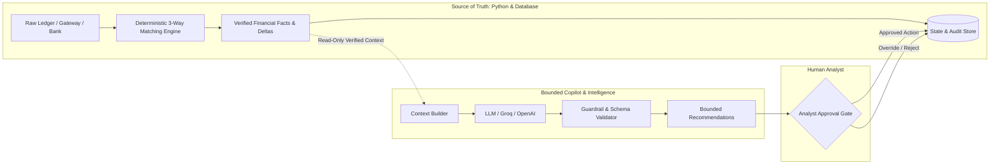

# ExceptionOS — The AI Boundary & Safety Framework

This document details the **AI Safety Architecture and Boundary Enforcement** in **ExceptionOS**. It explains why AI is bounded, how financial truth is isolated from generative models, and how deterministic rules govern all financial operations.

---

## 1. The Core Principle: Deterministic Truth First

> **Critical Law of ExceptionOS**:  
> **AI is NEVER the source of financial truth.**

In financial reconciliation, hallucination is catastrophic. If an LLM misidentifies an amount delta, invents a matching transaction ID, or silently writes off a missing bank deposit, the financial integrity of the organization is compromised.

Therefore, ExceptionOS strictly separates **Mathematical Truth** from **Operational Assistance**:



---

## 2. Boundary Matrix: Permitted vs. Prohibited AI Behaviors

| Capability / Action | Deterministic Engine | Bounded AI Copilot | Human Analyst |
| :--- | :---: | :---: | :---: |
| Calculate transaction amount differences (deltas) | ✅ **Sole Authority** | ❌ **Strictly Forbidden** | 👁️ Audits |
| Execute 3-way multi-source matching | ✅ **Sole Authority** | ❌ **Strictly Forbidden** | 👁️ Audits |
| Classify exceptions (duplicate, missing, fee mismatch) | ✅ **Sole Authority** | ❌ **Strictly Forbidden** | ✏️ Can Override |
| Mutate database records directly | ❌ Bounded Service API | ❌ **Strictly Forbidden** | ✅ Authorized |
| Authorize ledger adjustments or write-offs | ❌ Not Authorized | ❌ **Strictly Forbidden** | ✅ **Sole Authority** |
| Summarize verified exception causes | ❌ Generates Hypotheses | ✅ **Permitted** | 👁️ Reads |
| Suggest operational next steps (from whitelist) | ❌ Rule-based priority | ✅ **Permitted** | ✅ Approves / Rejects |
| Chat over verified investigation case context | ❌ Not conversational | ✅ **Permitted** | 💬 Interacts |

---

## 3. How Deterministic Facts Are Protected

### 3.1 Strict Read-Only Context Injection
The AI subsystem (`src/exceptionos/ai/copilot.py` and `src/exceptionos/ai/agent.py`) never interacts with raw CSV files, arbitrary SQL queries, or uncontrolled network inputs.
- All prompts are constructed using strictly formatted, pre-calculated Python dictionaries retrieved from `CaseRecord`, `Dataset`, and `EventRecord`.
- Context contains only:
  - Exact verified amounts (`left_amount`, `right_amount`, `delta`)
  - Deterministic classification (`amount_mismatch`, `unmatched_left`, etc.)
  - Rule-based root-cause hypothesis and confidence score
  - Historical timeline of recorded audit events

### 3.2 Closed-Set Action Whitelist
The AI Agent cannot invent or execute arbitrary scripts or commands. Its output is constrained to a finite enumeration (`ALLOWED_ACTIONS`):
```python
ALLOWED_ACTIONS = [
    "INVESTIGATE_SOURCE",        # Flag source system data pipeline for inspection
    "REQUEST_ANALYST_REVIEW",    # Escalate to human domain expert
    "VERIFY_DUPLICATE",          # Trigger secondary duplicate verification
    "RECHECK_SETTLEMENT",        # Queue case for polling next settlement cycle
    "MARK_FOR_FOLLOW_UP",        # Non-financial operational tracking
    "AUTO_RESOLVE_ONLY_IF_SAFE"  # Permitted ONLY when deterministic proof exists
]
```
If the model returns any action outside this whitelist, the system rejects it and defaults to `REQUEST_ANALYST_REVIEW`.

---

## 4. Guardrails and Output Sanitization

The guardrail layer (`src/exceptionos/ai/guardrails.py`) intercepts all raw LLM completions before they reach the API or UI:

### 4.1 Schema Normalization & Markdown Sanitization
LLMs frequently wrap outputs in markdown code fences (e.g. ```` ```json ... ``` ````) or append conversational preamble. `normalize_ai_response()` performs multi-stage sanitization:
1. Strips leading and trailing backticks and markdown code fences.
2. Parses JSON payloads safely with comprehensive exception handling.
3. Fallbacks gracefully if the response is plain text, preserving the text in the `answer` field while assigning zero-confidence and safe default metadata.

### 4.2 Strict Pydantic Schema Validation
The sanitized dictionary is validated against the `CopilotResponse` Pydantic model:
```python
class CopilotResponse(BaseModel):
    response_mode: Literal["general", "case_analysis", "dataset_analysis", "insufficient_data"]
    answer: str
    verified_facts: List[str]
    recommendations: List[str]
    confidence: float
    sources: List[str]
```
Any schema mismatch raises a `GuardrailException`, prompting the system to return an error-proof `create_safe_copilot_response()` response.

---

## 5. Human-in-the-Loop Governance Gate

ExceptionOS enforces mandatory human oversight for all non-trivial financial actions:

1. **Automatic Approval Mandate**:
   ```python
   # Enforce rule in src/exceptionos/ai/agent.py
   if risk_level in ["HIGH", "CRITICAL"]:
       requires_approval = True
   ```
2. **Audit Sourcing**:
   Every recommendation creates an `AgentAction` record with status `PENDING` and records `actor="AI_AGENT"`.
3. **Analyst Decision**:
   The analyst reviews the recommendation within the Investigation Workspace. Only when the analyst clicks **Approve** or **Reject** is the case state updated, and the reviewer's user ID and timestamp are permanently written to the audit log.

---

## 6. Offline Safety and Provider Fallback

If an external LLM API (Groq, OpenAI) is unavailable, misconfigured, or rate-limited:
- The deterministic reconciliation pipeline continues running without interruption.
- The AI health endpoint reports `UNAVAILABLE` or `MOCK_MODE`.
- All pending exception cases automatically generate safe fallback actions:
  ```python
  AgentAction(
      case_id=case.id,
      recommended_action="REQUEST_ANALYST_REVIEW",
      reason=f"Failed to generate action: {str(e)}",
      risk_level="HIGH",
      requires_approval=True,
      status="PENDING",
      actor="SYSTEM_FALLBACK"
  )
  ```
- **Result**: The organization's books and reconciliation pipeline never stop or fail due to third-party AI outages.
