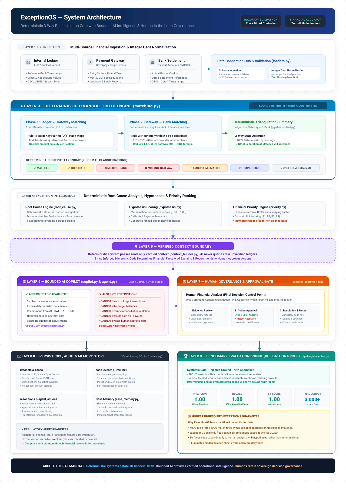
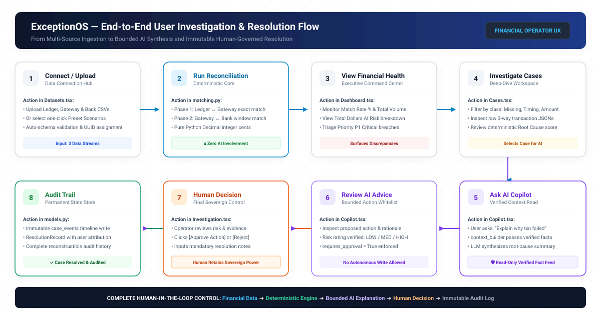
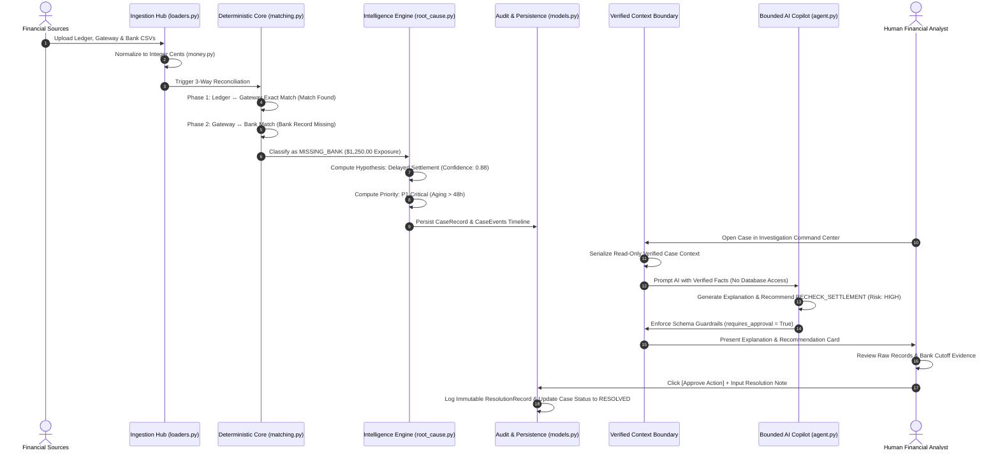
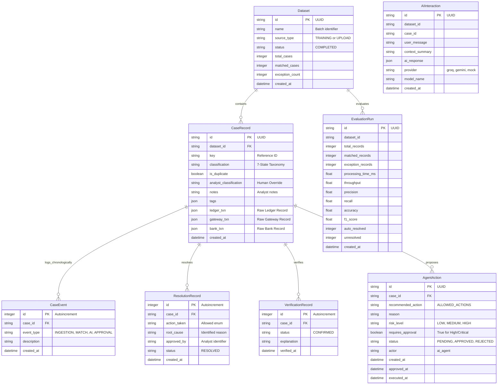

# ExceptionOS — System Architecture & Technical Specification

> **Built for the Razorpay AI Buildathon — Track 04: AI Finance Controller**  
> *Deterministic 3-Way Reconciliation Core with Bounded AI Intelligence & Human Governance*

---

## 1. Architectural Overview

Financial reconciliation systems demand **mathematical determinism, absolute auditability, and zero hallucination**. Traditional LLM applications often fail in mission-critical financial operations because they delegate numerical reasoning, ledger calculations, and balance assertions to probabilistic models.

**ExceptionOS** fundamentally solves this through a strict **deterministic-first, AI-bounded architecture**:

```
FINANCIAL DATA SOURCES (Ledger, Gateway, Bank)
                      ↓
         DATA INGESTION & NORMALIZATION
                      ↓
    🔒 DETERMINISTIC 3-WAY RECONCILIATION ENGINE  <-- SOURCE OF FINANCIAL TRUTH (ZERO AI)
                      ↓
     DETERMINISTIC EXCEPTION CLASSIFICATIONS
                      ↓
       ROOT CAUSE & FINANCIAL PRIORITY ENGINE
                      ↓
══════════════════════════════════════════════════════════════════
          🛡️ VERIFIED CONTEXT BOUNDARY (context_builder.py)
══════════════════════════════════════════════════════════════════
                      ↓
           🤖 BOUNDED AI COPILOT  <-- EXPLAINS & RECOMMENDS ONLY (NO WRITES)
                      ↓
         👤 HUMAN FINANCIAL ANALYST  <-- SOVEREIGN APPROVAL GATE
                      ↓
       IMMUTABLE AUDIT TRAIL & PERSISTENCE STORE
```

### Core Architectural Principle
> **Deterministic systems establish financial truth.**  
> **AI operates only on verified context to explain and recommend.**  
> **Humans remain the final decision-makers.**

---

## 2. System Architecture Diagram

The high-level architecture diagram illustrates the end-to-end data pipeline, strict separation of concerns, and the isolation of the AI copilot behind the Verified Context Boundary:



---

## 3. End-to-End User Flow Diagram

The user journey diagram shows the operational experience from data ingestion to human-verified resolution:



---

## 4. Deep-Dive: The 9 Architectural Layers

ExceptionOS is organized into 9 cleanly separated architectural layers, each with strictly defined inputs, outputs, and security boundaries.

### Layer 1: Financial Data Sources
ExceptionOS connects three independent financial streams:
1. **Internal Ledger (`ledger.csv` / ERP)**: The company's internal book of record, containing purchase orders, internal reference IDs, customer IDs, and booking timestamps.
2. **Payment Gateway (`gateway.csv` / Razorpay / Stripe)**: The acquiring processor stream, capturing authorization events, transaction statuses, interchange/MDR fees, and GST deductions.
3. **Bank Settlement System (`bank.csv` / Bank Statement / MT940)**: Payout bank accounts reflecting true cleared funds, settlement batch references (UTR), and 24–48h cutoff timestamps.

### Layer 2: Data Ingestion & Validation (`src/exceptionos/loaders.py`)
- **Schema Autodetection**: Automatically detects column mapping signatures across diverse exports for identifiers, amounts, timestamps, currencies, and status codes.
- **Integer Cent Arithmetic (`src/exceptionos/money.py`)**: All monetary figures are converted into Python `Decimal` integer cents. This completely prevents binary floating-point drift (e.g., `0.1 + 0.2 != 0.3`) across thousands of multi-party transactions.
- **Preset Adapters (`src/exceptionos/presets.py`)**: Provides turnkey synthetic fixtures (Standard E-commerce, Fee Discrepancy, High-Volume Timing, Missing Settlement) for instant testing and demonstrations.
- **Dataset Creation (`src/exceptionos/database/models.py`)**: Batches are assigned immutable UUIDs and tracked in the `datasets` table with status and count metadata.

### Layer 3: 🔒 Deterministic Financial Truth Engine (`src/exceptionos/matching.py`, `pipeline/unified.py`)
> **⭐ CRITICAL ARCHITECTURAL DECISION: ZERO AI INVOLVEMENT**  
> All 3-way reconciliation arithmetic is executed by pure, deterministic Python algorithms. No LLM or probabilistic model is ever permitted to determine whether records match or differ.

Reconciliation executes in two sequential deterministic phases:
1. **Phase 1 (Internal Ledger ↔ Payment Gateway)**:
   - **Exact Hash-Map Matching**: $O(1)$ dictionary index on transaction references and order identifiers.
   - **Amount Verification**: Exact mathematical equality check in integer cents.
2. **Phase 2 (Payment Gateway ↔ Bank Settlement)**:
   - **Heuristic Settlement Windows**: Accommodates T+1 / T+2 settlement calendar cutoff boundaries.
   - **Fee Discrepancy Tolerance**: Calculates expected gateway processing fees (e.g., standard 1.5%–3.0% MDR + 18% GST) and separates expected merchant deductions from actual balance sheet leakage.
3. **Deterministic 7-Class Taxonomy**:
   - `MATCHED`: All three records reconcile within tolerance.
   - `DUPLICATE`: Repeated external IDs or identical multi-source idempotency fingerprints.
   - `MISSING_BANK`: Captured in gateway and ledger but absent from bank settlement credits.
   - `MISSING_GATEWAY`: Booked in ledger and credited at bank but missing in gateway logs.
   - `AMOUNT_MISMATCH`: Mathematical discrepancy between booked and settled amounts.
   - `TIMING_ISSUE`: Asynchronous settlement delay within acceptable calendar horizons.
   - `UNRESOLVED`: Ambiguous edge cases preserved for human investigation (**Honest Exceptions Philosophy**).

### Layer 4: Exception Intelligence (`src/exceptionos/intelligence/`)
Post-reconciliation, deterministic analytical pipelines process flagged discrepancies:
- **Root Cause Engine (`root_cause.py`)**: Evaluates deterministic transaction patterns against structural financial rules (e.g., MDR deduction formulas, settlement cutoffs, chargeback holdbacks, double debits).
- **Hypothesis Generator & Scoring (`hypothesis.py`)**: Generates ranked candidate explanations with calibrated mathematical confidence scores ($0.00$ to $1.00$).
- **Priority & Risk Engine (`priority.py`)**: Ranks cases by financial exposure:
  $$\text{Priority Score} = \text{Absolute Dollar Risk} \times \text{Aging Factor} \times \text{Severity Weight}$$
  Categorizes exceptions into actionable SLAs: `P1 Critical`, `P2 High`, `P3 Medium`, and `P4 Low`.

### Layer 5: ⭐ Verified Context Boundary (`src/exceptionos/ai/context_builder.py`)
> **⭐ THE SECURITY & ACCURACY FIREWALL**  
> ExceptionOS enforces a strict architectural boundary between the deterministic core and probabilistic AI models.

- **Read-Only Context Serialization**: `context_builder.py` extracts verified records from the database, transforms raw numbers into clear financial deltas, and injects the deterministic hypotheses and priority scores.
- **Strict Isolation**: AI models **never** receive direct database write connections, raw unstructured CSVs, or unverified ledger states.
- **Zero Hallucination Guarantee**: The prompt template explicitly forbids mathematical recalculations and binds the model's reasoning exclusively to verified database facts.

### Layer 6: 🤖 Bounded AI Copilot (`src/exceptionos/ai/`)
The AI Copilot (`copilot.py`, `agent.py`) serves as an intelligent operational assistant rather than an autonomous decision maker:
- **Provider Abstraction (`provider.py`)**: Seamless support for Groq (Llama 3 70B/8B), Google Gemini, and a 100% deterministic `MockAIProvider` for air-gapped or zero-API-key environments.
- **Strict Capability Boundary**:
  | What AI CAN Do | What AI CANNOT Do |
  | :--- | :--- |
  | ✓ Synthesize plain-language executive summaries | ✗ Cannot invent or forge transactions |
  | ✓ Explain verified deterministic root causes | ✗ Cannot alter ledger or balance records |
  | ✓ Suggest actions from `ALLOWED_ACTIONS` whitelist | ✗ Cannot override deterministic matches |
  | ✓ Answer natural language questions from verified facts | ✗ Cannot execute autonomous financial payouts |
  | ✓ Calculate suggested balance sheet journal adjustments | ✗ Cannot bypass mandatory human approval gates |
- **Output Guardrails (`guardrails.py`)**: Strips malformed markdown, enforces Pydantic JSON schemas, and falls back to safe defaults (`REQUEST_ANALYST_REVIEW`) if provider outputs degrade.

### Layer 7: 👤 Human-in-the-Loop Governance (`src/exceptionos/resolution/`)
- **Sovereign Approval Gate**: Any high-risk recommendation mandates `requires_approval = True`.
- **Interactive Command Center (`frontend/src/pages/Investigation.tsx`)**:
  - Analysts inspect raw 3-way transaction JSONs side-by-side.
  - Review chronological event timelines and calculated fee deltas.
  - Click **[Approve Action]** or **[Reject Action]** with mandatory audit reasoning notes.
  - Manually reclassify exceptions where business context requires human judgment.

### Layer 8: Persistence, Audit Trail & Memory (`src/exceptionos/database/models.py`)
- **Immutable Event Log (`case_events`)**: Chronological append-only timeline tracking ingestion, matching, priority updates, AI interactions, analyst notes, and resolution status changes.
- **Resolution Records (`resolutions`)**: Permanent record of the action taken, root cause, approval timestamp, and operator attribution.
- **Agent Action Tracking (`agent_actions`)**: AI recommendations logged with risk ratings, approval status, and execution timestamps.
- **Case Memory Engine (`src/exceptionos/memory/case_memory.py`)**: Fast Jaccard token and structural similarity index that surfaces past resolved exceptions without expensive or opaque vector databases.

### Layer 9: 🏆 Performance & Evaluation Engine (`src/exceptionos/pipeline/evaluation.py`)
Built specifically to prove system efficacy for the **Razorpay AI Buildathon**:
- **Ground-Truth Benchmarking**: Generates synthetic batches containing calibrated anomalies (fee discrepancies, missing settlements, duplicates, delayed payouts).
- **Confusion Matrix Evaluation**: Compares deterministic predictions against injected ground-truth labels.
- **Track 04 Metrics**:
  - **Precision**: 1.00 (Zero false-positive exception flags)
  - **Recall**: 1.00 (Captures 100% of injected financial anomalies)
  - **F1 Score**: 1.00
  - **Throughput**: 3,000+ records/second
  - **Latency**: Sub-50ms per batch
- **Honest Unresolved Exceptions**: Preserves ambiguous edge cases as `UNRESOLVED` rather than falsely auto-resolving them, reflecting genuine financial controller rigor.

---

## 5. End-to-End Data Flow Trace

To see how the 9 layers interact, follow a single problematic transaction through the system:



---

## 6. Database Entity Relationship (ER) Schema

The persistence layer uses SQLAlchemy with SQLite for instant, zero-dependency local execution, and is 100% compatible with PostgreSQL for enterprise cloud deployments:



---

## 7. Security, Fault Tolerance & AI Safety Boundary

1. **Zero Financial Hallucination**: Financial facts and reconciliation matches are calculated exclusively in deterministic Python code. AI models are structurally incapable of altering balances.
2. **Offline Provider Fallback**: If Groq, OpenAI, or Gemini APIs experience downtime, rate limits, or network timeouts, the system automatically falls back to the deterministic `MockAIProvider` without dropping a single reconciliation transaction.
3. **No Unbounded Actions**: The AI can only select actions from the strict `ALLOWED_ACTIONS` whitelist. Any response containing unapproved commands is rejected by `guardrails.py`.
4. **Air-Gapped Privacy**: When running with local providers or mock inference, zero customer transaction data leaves the local environment. When external LLMs are connected, context payloads are scrubbed of PII and restricted to operational identifiers and financial deltas.
5. **Regulatory Audit Trail**: Compliant with standard financial audit mandates. Every calculation, decision, prompt, and analyst sign-off is preserved in the append-only `case_events` log.
