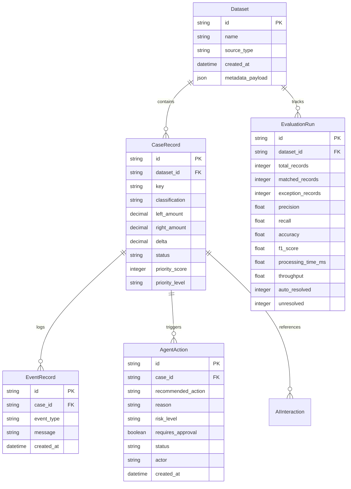

# ExceptionOS — System Architecture

This document provides a comprehensive technical overview of **ExceptionOS**, an AI-assisted financial operations and deterministic 3-way reconciliation platform built for the **Razorpay AI Buildathon — Track 04: AI Finance Controller**.

---

## 1. Architectural Philosophy

Financial systems demand **mathematical determinism, auditability, and zero hallucination**. Traditional LLM applications often fail in finance because they entrust numerical calculations and truth evaluation to probabilistic models.

ExceptionOS implements a strict **deterministic-first, AI-bounded architecture**:
1. **Financial Truth is Deterministic**: All numerical comparisons, 3-way record matching, tolerance calculations, and exception classifications are executed using pure, deterministic Python arithmetic with `Decimal` precision.
2. **AI is a Bounded Operational Copilot**: AI models never create, alter, or reconcile transactions. They act exclusively as operational assistants that synthesize verified data, explain root causes, recommend standardized actions from an allowed enum, and assist human analysts.
3. **Humans Retain Governance**: Material financial decisions (ledger write-offs, dispute filings, manual reconciliations) require explicit analyst confirmation.
4. **Immutable Audit Trail**: Every ingestion event, matching decision, hypothesis generation, AI interaction, and analyst approval is recorded chronologically.

---

## 2. High-Level Component Architecture

```mermaid
flowchart TD
    subgraph Data Layer [Multi-Source Data Ingestion]
        L[Internal Ledger CSV]
        G[Payment Gateway CSV]
        B[Bank Settlement CSV]
    end

    subgraph Core Engine [Deterministic Reconciliation Engine]
        NORM[Data Normalization & Decimal Typing]
        P1[Phase 1: Ledger <--> Gateway Matching]
        P2[Phase 2: Gateway <--> Bank Matching]
        EXC[Exception Classifier]
    end

    subgraph Intelligence [Root Cause & Priority Layer]
        RC[Root Cause Hypothesis Engine]
        PRIO[Priority & Risk Scoring Engine]
        TIME[Evidence Timeline Generator]
    end

    subgraph Persistence [State & Audit Store]
        DB[(SQLite / PostgreSQL via SQLAlchemy)]
        AUDIT[Immutable Event & Action Log]
    end

    subgraph Copilot [Bounded AI Layer]
        PROV[AI Provider Abstraction (Groq / OpenAI / Mock)]
        AGENT[Resolution Agent (Bounded Action Schema)]
        GUARD[Guardrails & Schema Normalizer]
    end

    subgraph Presentation [User Experience]
        API[FastAPI Modular REST Service]
        UI[React 19 + TypeScript Financial Command Center]
        HUMAN[Human Financial Analyst (Review & Approval)]
    end

    L & G & B --> NORM
    NORM --> P1
    P1 --> P2
    P2 --> EXC
    EXC --> RC
    RC --> PRIO
    PRIO --> TIME
    TIME --> DB
    DB --> AUDIT
    DB --> API
    API --> UI
    UI <--> HUMAN
    HUMAN -->|Approve / Override| API
    API <--> AGENT
    AGENT <--> PROV
    PROV --> GUARD
    GUARD --> AGENT
    AGENT --> DB
```

---

## 3. Detailed Component Breakdown

### 3.1 Data Ingestion & Normalization (`src/exceptionos/loaders.py`, `presets.py`)
- **Schema Autodetection**: Analyzes header signatures to detect column mapping for `transaction_id`, `amount`, `date`, and `currency`.
- **Preset Adapters**: Built-in support for Stripe, Razorpay, and generic bank settlement CSV exports.
- **Financial Arithmetic**: Amounts are parsed into Python's `Decimal` types to avoid binary floating-point representation artifacts (e.g., `0.1 + 0.2 != 0.3`).
- **Data Model**: Records are structured into `Transaction` dataclasses with strict typing.

### 3.2 Deterministic 3-Way Matching Engine (`src/exceptionos/matching.py`, `pipeline/unified.py`)
Reconciliation runs in two sequential deterministic phases:
1. **Phase 1 (Internal Ledger ↔ Payment Gateway)**:
   - **Exact Matching**: Matches records where `id` and `amount` match exactly.
   - **Amount Mismatch Detection**: If IDs match but amounts differ beyond tolerance, an `amount_mismatch` exception is raised with the computed delta.
   - **Heuristic Matching**: For unmatched items, evaluates transactions within a sliding date window (default: ±3 days) and amount tolerance (e.g., absorbing standard gateway transaction fees).
2. **Phase 2 (Payment Gateway ↔ Bank Settlement)**:
   - Validates that settled amounts in the bank account match processed gateway payouts.
   - Identifies settlement timing delays, bank processing fees, and chargeback holds.
3. **Classification Taxonomy**:
   - `matched`: All three sources reconcile within configured parameters.
   - `amount_mismatch`: Variance identified across sources.
   - `unmatched_left` / `unmatched_right`: Missing counterpart in ledger or gateway/bank.
   - `duplicate`: Repeated identifier or identical transaction fingerprint.
   - `timing_issue`: Delayed settlement or asynchronous processing lag.
   - `date_mismatch`: Timestamp delta exceeding window.
   - `unknown`: Complex multi-variable exception requiring deep analysis.

### 3.3 Root Cause Hypothesis Engine (`src/exceptionos/intelligence/root_cause.py`)
Evaluates deterministic signals and classifies exceptions into rule-based hypotheses:
- `GATEWAY_FEE_DEDUCTION`: Discrepancy matches configured or typical percentage/flat interchange fees.
- `SETTLEMENT_DELAY`: Transaction exists in ledger/gateway but bank settlement timestamp lags by 24–72 hours.
- `DUPLICATE_TRANSACTION`: Multiple attempts for the same order ID or exact timestamp/amount collisions.
- `MISSING_BANK_DEPOSIT`: Gateway captured payment without corresponding settlement payout.
- `REFUND_REVERSAL`: Negative ledger credit or gateway refund event.

Each hypothesis produces:
- `confidence`: Calibrated score (0.0 to 1.0) based on mathematical evidence.
- `reasoning`: Deterministic trail explaining why this hypothesis was generated.
- `evidence_keys`: References to source line numbers and raw payloads.

### 3.4 Priority & Risk Engine (`src/exceptionos/intelligence/priority.py`)
Ranks exceptions to focus analyst attention where financial risk is highest:
- **Financial Exposure**: Absolute dollar value of discrepancy.
- **SLA Urgency**: Age of transaction and settlement cutoffs.
- **Classification Risk**: High severity for missing bank deposits; medium severity for fee mismatches.
- **Scoring**: Generates an integer score (0–100) and discrete bucket (`CRITICAL`, `HIGH`, `MEDIUM`, `LOW`).

### 3.5 Bounded AI Copilot & Resolution Agent (`src/exceptionos/ai/`)
- **Strictly Separated Context**: The AI only receives structured JSON containing verified records, calculated deltas, and deterministic hypotheses. It never interacts directly with raw, unvalidated CSVs.
- **Strict Action Whitelist**:
  ```python
  ALLOWED_ACTIONS = [
      "INVESTIGATE_SOURCE",
      "REQUEST_ANALYST_REVIEW",
      "VERIFY_DUPLICATE",
      "RECHECK_SETTLEMENT",
      "MARK_FOR_FOLLOW_UP",
      "AUTO_RESOLVE_ONLY_IF_SAFE"
  ]
  ```
- **Guardrails & Schema Normalization (`guardrails.py`)**:
  - Sanitizes LLM outputs, strips markdown code blocks, and validates against Pydantic models.
  - Guarantees valid fallback structures (`insufficient_data` or `REQUEST_ANALYST_REVIEW`) if the LLM output is malformed or times out.
- **Provider Resilience (`provider.py`)**:
  - Multi-provider support: Groq (Llama 3 70B/8B), OpenAI (GPT-4o), and deterministic `MockAIProvider`.
  - Graceful fallback: If an external provider is unreachable or unconfigured, the system automatically falls back to safe deterministic recommendations without crashing the reconciliation pipeline.

### 3.6 Human-in-the-Loop & Audit Trail (`src/exceptionos/database/models.py`)
- **Approval Gate**: Any action flagged with `risk_level in ["HIGH", "CRITICAL"]` mandates `requires_approval = True`.
- **Audit Persistence**:
  - `Dataset`: Uploaded batches and execution metadata.
  - `CaseRecord`: Individual reconciliation exceptions, classifications, and priorities.
  - `EventRecord`: Complete timeline of status changes, annotations, and system events.
  - `AgentAction`: AI-generated recommendations with reviewer decisions (`PENDING`, `APPROVED`, `REJECTED`).
  - `AIInteraction`: Complete log of prompts and sanitized completions for governance reviews.

---

## 4. Database Schema

The persistence layer uses SQLAlchemy with SQLite for local execution and zero-dependency demos, easily configurable to PostgreSQL in production:



---

## 5. Security and Operational Integrity

- **Zero Data Leakage**: In mock/local mode, no financial data ever leaves the local machine. When configured with Groq or OpenAI, only sanitized operational case summaries (with PII omitted) are passed.
- **Idempotent Reconciliation**: Running reconciliation on the same files produces identical, verifiable outputs.
- **Fail-Safe Defaults**: If any component of the AI subsystem fails, the core financial pipeline remains 100% operational, and exceptions default to `REQUEST_ANALYST_REVIEW`.
